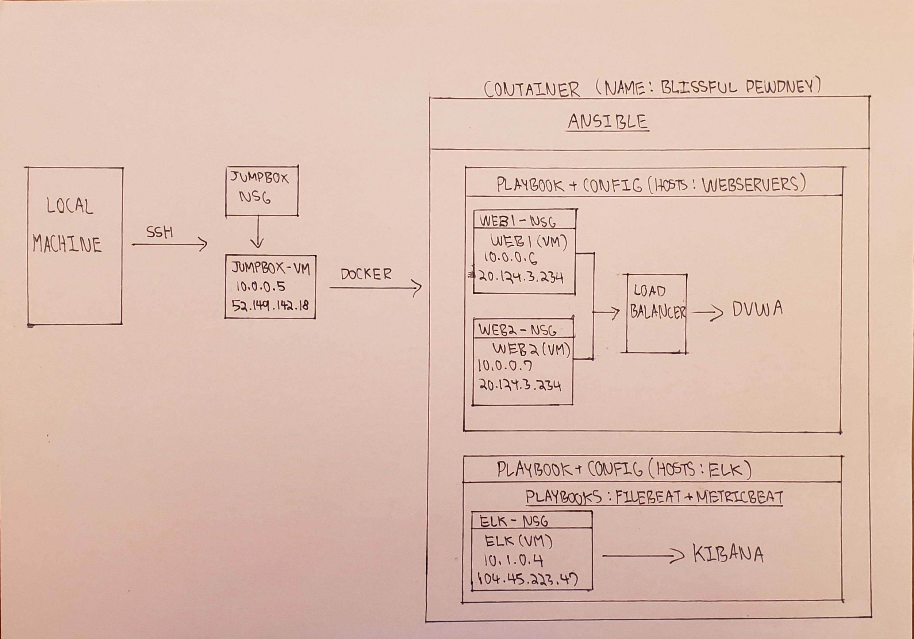
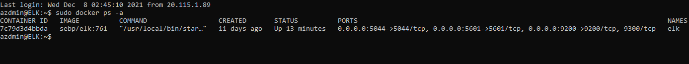
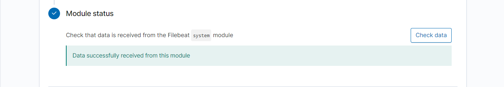
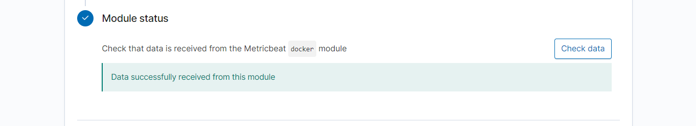

## Automated ELK Stack Deployment

The files in this repository were used to configure the network depicted below.

These files have been tested and used to generate a live ELK deployment on Azure. They can be used to either recreate the entire deployment pictured above. Alternatively, select portions of the network diagram file may be used to install only certain pieces of it, such as Filebeat.

  - 
  - 
  - 

This document contains the following details:
- Description of the Topology
- Access Policies
- ELK Configuration
  - Beats in Use
  - Machines Being Monitored
- How to Use the Ansible Build

### Description of the Topology

The main purpose of this network is to expose a load-balanced and monitored instance of DVWA, the Dmn Vulnerable Web Application.

-Load balancing ensures that the application will be highly accesible, in addition to restricting traffic to the network.
- Load balancers help with traffic over servers to ensure that the application runs accordingly. In addition, they prevent an application from having their services denied due to single points of failure by rerouting traffic from one server to another. 
- Having a jump box allows an admin to securely connect to it as a gateway when performing administrative tasks. It provides and acts as another point of security.

Integrating an ELK server allows users to easily monitor the vulnerable VMs for changes to the network and system logs.
- Filebeat is a logging agent that watches for specified log files or locations and collects log events. The data is then forwarded to Elasticsearch or Logstash for indexing. 
- Metricbeat is an agent used to collect metric/statistical data from selected servers and is then forwarded to Elasticsearch/Logstash  

The configuration details of each machine may be found below:

| Name     | Function | IP Address                              | Operating System |
|----------|----------|-----------------------------------------|------------------|
| Jump Box | Gateway  | 10.0.0.5(Private) 52.149.142.18(Public) | Linux            |
| Web1     | Server   | 10.0.0.6(Private) 20.124.3.234(Public)  | Linux            |
| Web2     | Server   | 10.0.0.7(Private) 20.124.3.234(Public)  | Linux            |
| ELK      | Server   | 10.1.0.4(Private) 104.45.223.47(Public) | Linux            |

### Access Policies

The machines on the internal network are not exposed to the public Internet. 

Only the Jump Box machine can accept connections from the Internet. Access to this machine is only allowed from the following IP addresses:
- 108.217.225.155

Machines within the network can only be accessed by the Jump Box.
- The Jump Box is the machine used to access the ELK VM

A summary of the access policies in place can be found in the table below.

| Name     | Publicly Accessible | Allowed IP Addresses |
|----------|---------------------|----------------------|
| Jump Box | Yes                 | 108.217.225.155      |
| Web1     | No                  | 10.0.0.5             |
| Web2     | No                  | 10.0.0.5             |
| ELK      | No                  | 10.0.0.5             |

### Elk Configuration

Ansible was used to automate configuration of the ELK machine. No configuration was performed manually, which is advantageous because...
- Ansible allows for provisioning, users may then smoothly transition into configuration management, orchestration, and application deployment. It is a very useful IT automation engine. 

The playbook implements the following tasks:
- Step 1: SSH into Jump Box (ssh azdmin@52.149.142.18)
- Step 2: Start and attach to ansible docker (sudo docker start blissful dewdney) --> (sudo docker attach blissful dewdney)
- Step 3: Navigate to (cd /etc/ansible) directory to create the ELK playbook (nano install-elk.yml)
- Step 4: Run the playbook in the directory (ansible-playbook install-elk.yml)
- Step 5: ssh into the ELK VM (ssh azdmin@104.45.223.47) to check if the server is successfuly made and running

The following screenshot displays the result of running `docker ps` after successfully configuring the ELK instance.

### Target Machines & Beats
This ELK server is configured to monitor the following machines:
- Web1 (IP: 10.0.0.6)
- Web2 (IP: 10.0.0.7)

We have installed the following Beats on these machines:
- 
- 

These Beats allow us to collect the following information from each machine:
- Filebeat is used for collecting logs on remote machines. When we need specific information, such as time and location, filters can be made to help find the data needed.
- Metricbeat is used to monitor servers and their performance. It can be used to check the system CPU, memory, and load.
### Using the Playbook
In order to use the playbook, you will need to have an Ansible control node already configured. Assuming you have such a control node provisioned: 

SSH into the control node and follow the steps below:
- For Filebeat:
- Copy the filebeat-config.yml file to /etc/ansible/files.
- Update the filebeat-config.yml file to include the ELK private IP
- Run the playbook, and navigate to http://104.45.223.47:5601 to check that the installation worked as expected.

- For Metricbeat:
- Copy the metricbeat-config.yml file to /etc/ansible/files.
- Update the metricbeat-config.yml file to include the ELK private IP
- Run the playbook, and navigate to http://104.45.223.47:5601 to check that the installation worked as expected.

Questions:
- Which file is the playbook? (filebeat-playbook.yml)
- Where do you copy it? (/etc/ansble/roles)
- Which file do you update to make Ansible run the playbook on a specific machine? (/etc/ansible/hosts) file
- How do I specify which machine to install the ELK server on versus which to install Filebeat on? (Within the hosts file, there will be two separate groups: webservers & ELK. The ELK group would have the IP of the VM where ELK will be installed)
- Which URL do you navigate to in order to check that the ELK server is running? (http://104.45.223.47:5601)
